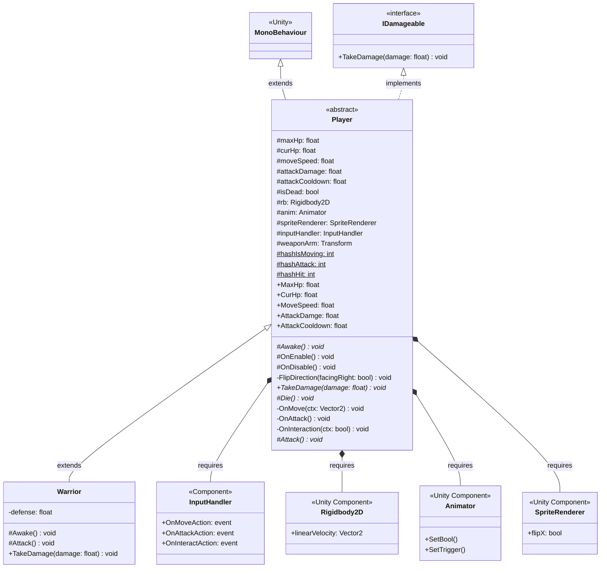
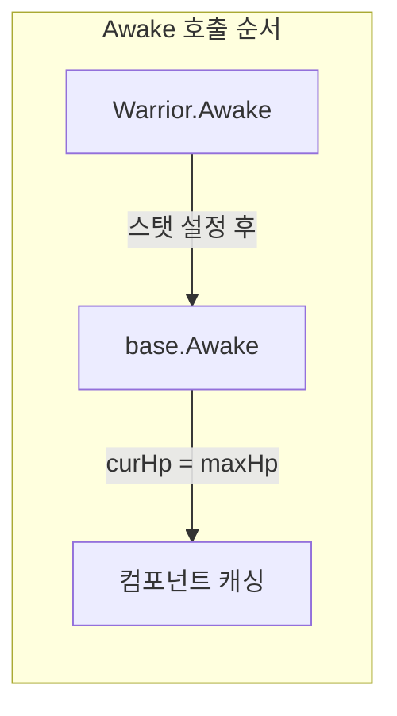
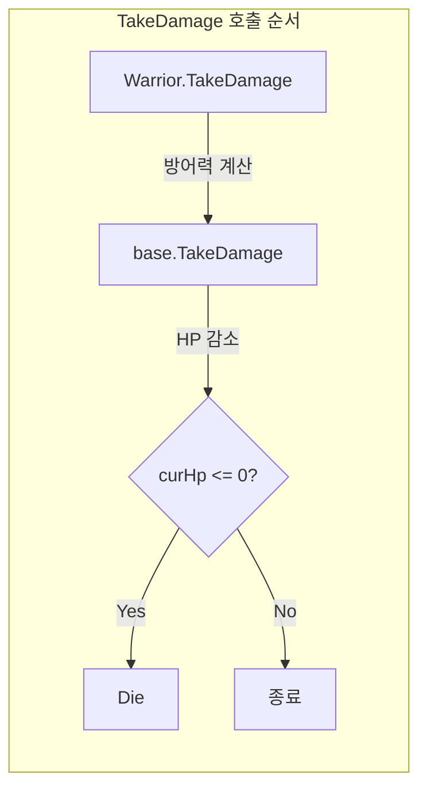

# Player-Warrior 클래스 UML 다이어그램

## 클래스 다이어그램

## 관계 설명

| 관계 | 설명 |
|------|------|
| `MonoBehaviour <\|-- Player` | Player는 Unity의 MonoBehaviour를 상속 |
| `IDamageable <\|.. Player` | Player는 IDamageable 인터페이스를 구현 |
| `Player <\|-- Warrior` | Warrior는 Player를 상속 |
| `Player *-- Components` | Player는 RequireComponent로 필수 컴포넌트 명시 |

## 메서드 접근 제어자 범례

| 기호 | 의미 |
|------|------|
| `+` | public |
| `#` | protected |
| `-` | private |
| `*` | virtual |
| `$` | static |

## 오버라이드 체인

---

*작성일: 2026-01-25*
